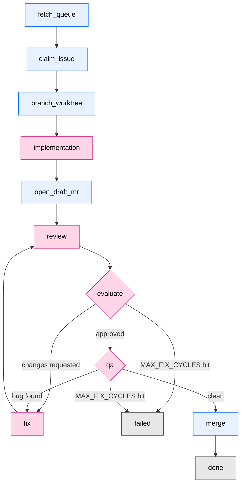

<div align="center">
  

  # kirby-bot

  *A deterministic state machine that drives Claude Code through your issue queue — one issue at a time, until the queue is empty.*

  [Features](#features) • [How it works](#how-it-works) • [Prerequisites](#prerequisites) • [Quick start](#quick-start) • [Configuration](#configuration) • [Architecture](#architecture)
</div>

---

> [!WARNING]
> **Alpha — expect breaking changes.** kirby-bot is in early development and its API, configuration, and behavior will evolve significantly. **GitLab** and **GitHub** are both supported; other providers are not yet implemented.

---

kirby-bot picks an issue off your issue board, spins up a fresh `claude` session in tmux for each phase of the work (implementation, review, evaluate, fix, qa), parses the verdict from the session, then opens a pull request (a merge request on GitLab) and merges it. If the reviewer disagrees, it loops back to `fix` until either the reviewer is satisfied or the cap is hit.

The bot is named after Kirby because, like Kirby, it eats issues whole and spits out merge requests.

## Features

- **Deterministic pipeline** — five named phases driven by an explicit state machine, not an open-ended agent loop.
- **Phase-per-session** — each interactive phase runs in an isolated `claude` tmux session with a phase-specific prompt; verdicts are parsed from the last assistant message via a Stop hook.
- **Self-healing fix loop** — `review` and `evaluate` decide whether to merge, fix, or fail. Up to `MAX_FIX_CYCLES` rounds before handing back to a human.
- **Hard budgets** — a 90-minute wall-clock cap per issue, per-phase caps, and a 2-minute ceiling on every shell-out. No hung command can freeze the run.
- **Run artifacts** — every run writes sentinel files, tmux logs, prompt files, and a structured `run.jsonl` to `~/.afk-runs/<run-id>/` for post-mortem.
- **Provider seam** — the orchestrator talks to GitLab and GitHub through a clean `Provider` interface, selected at startup via `KIRBY_PROVIDER`.
- **Crash recovery** — on startup, before reading the queue, the orchestrator releases issues whose `picked-by-agent` claim has gone stale (a crashed prior run), returning them to the queue.

## How it works

For each issue the bot picks up, it transitions through the following phases:



- **Interactive phases** (`implementation`, `review`, `evaluate`, `fix`, `qa`) spawn a fresh `claude` tmux session with a rendered prompt and wait for a verdict.
- **Script phases** (`open_draft_mr`, `merge`, plus setup/cleanup transitions) are pure shell work — no `claude` session.
- A **Stop hook** writes each session's last assistant message to a sentinel file; the orchestrator polls the sentinel and parses the verdict.

### Why tmux, not `claude -p`?

The orchestrator drives the **interactive** `claude` CLI inside a tmux session, not the headless `claude -p` flag or the Agent SDK. That distinction is billing-load-bearing.

> [!NOTE]
> Starting **June 15, 2026**, `claude -p` and the Claude Agent SDK no longer count toward your Claude plan's usage limits — they draw from a separate **monthly Agent SDK credit** ($20 on Pro, $100/$200 on Max). Interactive Claude Code usage stays on the regular plan limits. By driving the interactive CLI through tmux, kirby-bot reuses the limits you already pay for instead of burning through the (much smaller) SDK credit. See [Use the Claude Agent SDK with your Claude plan](https://support.claude.com/en/articles/15036540-use-the-claude-agent-sdk-with-your-claude-plan) for the full breakdown.

The full vocabulary (Phase / Verdict / Session / Provider / RunArtifacts / Module / Interface / Depth / Seam) is documented in [`CONTEXT.md`](CONTEXT.md).

## Prerequisites

- [Bun](https://bun.sh) ≥ 1.3.0
- [`tmux`](https://github.com/tmux/tmux)
- [`claude`](https://docs.claude.com/en/docs/claude-code) on your `$PATH`
- A GitLab or GitHub project with the orchestrator's labels configured (`ready-for-agent`, `picked-by-agent`, `failed-by-agent`, `code-review`, …)
- A long-lived personal access token (GitLab `api` scope / GitHub `repo` scope)
- The Claude Code skills the phase prompts (and their transitive fan-out) invoke via the `Skill` tool. All live in my [rbaumier/skills](https://github.com/rbaumier/skills) repo. The [Quick start](#quick-start) step `bun run setup-skills` populates them under `.claude/skills/` (project-scoped, which Claude Code resolves before `~/.claude/skills/`) — by symlinking from your `~/.claude/skills/` when present, or copying from a shallow clone of `rbaumier/skills` otherwise.

  **Directly invoked by the phase prompts:**
  - [`code-review`](https://github.com/rbaumier/skills/blob/main/code-review/SKILL.md) — invoked by the `review` phase to fan reviewer subagents over the diff.
  - [`dogfood`](https://github.com/rbaumier/skills/blob/main/dogfood/SKILL.md) — loaded by the persona subagents the `qa` phase spawns.

  **Transitively invoked by `code-review`'s fan-out.** The `code-review` skill spawns ~15+ reviewer subagents per Full-tier run; each loads its own skill via the `Skill` tool. The full set:

  | Bucket | Skills loaded |
  |---|---|
  | Always-spawn (Full tier) | [`matt-improve-codebase-architecture`](https://github.com/rbaumier/skills/blob/main/matt-improve-codebase-architecture/SKILL.md), [`matt-review`](https://github.com/rbaumier/skills/blob/main/matt-review/SKILL.md), [`thermo-nuclear-code-quality-review`](https://github.com/rbaumier/skills/blob/main/thermo-nuclear-code-quality-review/SKILL.md), [`security-defensive`](https://github.com/rbaumier/skills/blob/main/security-defensive/SKILL.md), [`coding-standards`](https://github.com/rbaumier/skills/blob/main/coding-standards/SKILL.md) (+ [`:design`](https://github.com/rbaumier/skills/blob/main/coding-standards:design/SKILL.md), [`:errors`](https://github.com/rbaumier/skills/blob/main/coding-standards:errors/SKILL.md), [`:hygiene`](https://github.com/rbaumier/skills/blob/main/coding-standards:hygiene/SKILL.md), [`:style`](https://github.com/rbaumier/skills/blob/main/coding-standards:style/SKILL.md)), [`testing`](https://github.com/rbaumier/skills/blob/main/testing/SKILL.md), [`matt-tdd`](https://github.com/rbaumier/skills/blob/main/matt-tdd/SKILL.md) |
  | By language extension | [`language-typescript`](https://github.com/rbaumier/skills/blob/main/language-typescript/SKILL.md), [`language-rust`](https://github.com/rbaumier/skills/blob/main/language-rust/SKILL.md), [`language-swift`](https://github.com/rbaumier/skills/blob/main/language-swift/SKILL.md), [`vue`](https://github.com/rbaumier/skills/blob/main/vue/SKILL.md) |
  | By import detected | [`better-result-adopt`](https://github.com/rbaumier/skills/blob/main/better-result-adopt/SKILL.md), [`database`](https://github.com/rbaumier/skills/blob/main/database/SKILL.md), [`docker`](https://github.com/rbaumier/skills/blob/main/docker/SKILL.md), [`drizzle-orm`](https://github.com/rbaumier/skills/blob/main/drizzle-orm/SKILL.md), [`i18n`](https://github.com/rbaumier/skills/blob/main/i18n/SKILL.md), [`kubernetes`](https://github.com/rbaumier/skills/blob/main/kubernetes/SKILL.md), [`react`](https://github.com/rbaumier/skills/blob/main/react/SKILL.md), [`shadcn`](https://github.com/rbaumier/skills/blob/main/shadcn/SKILL.md), [`tailwind`](https://github.com/rbaumier/skills/blob/main/tailwind/SKILL.md), [`tanstack-query`](https://github.com/rbaumier/skills/blob/main/tanstack-query/SKILL.md), [`tanstack-start-best-practices`](https://github.com/rbaumier/skills/blob/main/tanstack-start-best-practices/SKILL.md), [`ui-animations`](https://github.com/rbaumier/skills/blob/main/ui-animations/SKILL.md), [`vue`](https://github.com/rbaumier/skills/blob/main/vue/SKILL.md), [`zod`](https://github.com/rbaumier/skills/blob/main/zod/SKILL.md) |
  | By surface touched (path globs) | [`ui-ux`](https://github.com/rbaumier/skills/blob/main/ui-ux/SKILL.md), [`frontend`](https://github.com/rbaumier/skills/blob/main/frontend/SKILL.md), [`make-interfaces-feel-better`](https://github.com/rbaumier/skills/blob/main/make-interfaces-feel-better/SKILL.md), [`web-performance`](https://github.com/rbaumier/skills/blob/main/web-performance/SKILL.md), [`api-design`](https://github.com/rbaumier/skills/blob/main/api-design/SKILL.md) |

  Missing a transitively-spawned skill won't crash the phase — the spawning subagent fails its own `Skill` load and that slot is dropped from the review object — but the review will be silently shallower than intended.

> [!IMPORTANT]
> **The forge connection is read from environment variables only** — no `glab`/`gh` config file, no git-remote sniffing. `KIRBY_PROVIDER` selects the backend: `gitlab` (the default when unset) or `github`; any other value fails fast at startup with a clear `ProviderConfigError`. The chosen backend's variables are all required, and a missing one fails fast the same way.
>
> **GitLab** (`KIRBY_PROVIDER=gitlab`, or unset):
> - `KIRBY_GITLAB_TOKEN` — a personal access token (PAT) with the `api` scope.
> - `GITLAB_HOST` — the instance base URL, e.g. `https://gitlab.com`.
> - `GITLAB_PROJECT_PATH` — the `owner/repo` project path.
>
> **GitHub** (`KIRBY_PROVIDER=github`):
> - `KIRBY_GITHUB_TOKEN` — a personal access token (PAT) with the `repo` scope.
> - `GITHUB_REPO` — the `owner/repo` slug.
> - `GITHUB_HOST` — optional; defaults to `https://api.github.com`. Set it to a GitHub Enterprise base (e.g. `https://gh.corp.example/api/v3`) when needed.
>
> **OAuth2 tokens are not supported** — a single AFK run outlives their few-hour TTL. Create a long-lived PAT and export it before launching.
> ```bash
> glab api -X POST user/personal_access_tokens \
>   -f name=kirby-bot -f scopes[]=api
> export KIRBY_GITLAB_TOKEN=<the-returned-token>
> export GITLAB_HOST=https://gitlab.com
> export GITLAB_PROJECT_PATH=<owner>/<repo>
> ```

> [!TIP]
> **Discord notifications (optional)** — set `KIRBY_DISCORD_WEBHOOK_URL` to a Discord channel webhook and the orchestrator pushes one message per end-of-attempt fate: a merge (`done`), a give-up (`failed`), or a re-queue (`stalled` / `interrupted`). Unset, it is a silent no-op — no network call. Delivery is best-effort: a webhook failure is logged, never aborts a run. Each message's sender name is `kirby · <owner/repo> · <run-id>`, so several concurrent processes sharing one channel — even two runs on the same repo — stay distinguishable.

## Quick start

```bash
# 1. Install
bun install

# 2. Populate .claude/skills/ — symlinks from ~/.claude/skills/ where present,
#    falls back to a shallow clone of rbaumier/skills for the rest. Idempotent.
bun run setup-skills

# 3. Check the prerequisites (env vars depend on $KIRBY_PROVIDER — see Configuration)
which bun tmux claude
# GitLab (default):
test -n "$KIRBY_GITLAB_TOKEN" -a -n "$GITLAB_HOST" -a -n "$GITLAB_PROJECT_PATH" && echo "env set"
# GitHub (KIRBY_PROVIDER=github):
# test -n "$KIRBY_GITHUB_TOKEN" -a -n "$GITHUB_REPO" && echo "env set"

# 4. Run
bun run src/main.ts
```

The orchestrator picks the first issue labelled `ready-for-agent` in the configured project and drives it through the pipeline. Hit `Ctrl-C` at any time — `BunRuntime.runMain` interrupts the fiber so every finalizer (worktree cleanup, label restoration, session kill) runs before exit.

Run artifacts land under `~/.afk-runs/<run-id>/`. Per-issue git worktrees live under `~/.afk-worktrees/<repo>/<branch>/`.

> [!TIP]
> Watch a phase live with `tmux attach -t <session-name>` — the session name is logged to `run.jsonl` when the phase starts.

## Configuration

Every tunable constant lives in [`src/config.ts`](src/config.ts) — no scattered env vars, no hidden defaults. The dials worth knowing:

| Constant | Default | What it caps |
|---|---|---|
| `ISSUE_BUDGET_MS` | 4 h | Total wall-clock per issue, from `implementation` through `qa`. |
| `PHASE_CAP_MINUTES` | 25–180 min | Per-phase wall-clock cap. Secondary guard — the issue budget normally trips first. |
| `MAX_FIX_CYCLES` | 10 | Max review→fix loops before the issue is failed for a human. |
| `COMMAND_TIMEOUT_MS` | 2 min | Hard ceiling on any single shell-out (git, glab, jq, tmux). |
| `SENTINEL_POLL_MS` | 5 s | How often the orchestrator polls a phase's sentinel file. |
| `LABELS` | `ready-for-agent`, `picked-by-agent`, `failed-by-agent` | The GitLab labels the orchestrator reads and writes. |

Phase prompts live in [`assets/prompts/`](assets/prompts) — one file per interactive phase. They are rendered with `{scripts_dir}` substitution so helper scripts (`mr-discussion.ts`, …) resolve correctly inside the worktree.

## Project structure

```
src/
├── main.ts              # entry point — preflight, then runMachine
├── preflight.ts         # tool (jq/tmux/claude/git) + git-repo checks
├── config.ts            # every tunable in one place
├── pipeline/            # state machine + handlers + the `step` seam
├── phases/              # the five interactive Phase Modules
├── session/             # tmux + Stop hook + sentinel + verdict parsing
├── provider/            # forge adapter seam (GitLab + GitHub)
├── recovery/            # startup stale-claim recovery sweep
└── run-artifacts.ts     # per-run logs (run.jsonl, prompts, tmux output)

assets/
├── prompts/             # one prompt template per interactive phase
└── readme/              # README assets

scripts/
├── setup-skills.ts         # populate .claude/skills/ via symlink + fallback clone
└── mr-discussion.ts        # post/read MR discussion threads from prompts
```

## Architecture

For the design rationale and the deeper docs:

- [`CONTEXT.md`](CONTEXT.md) — living glossary. Canonical names for Phase / Verdict / Session / Provider / RunArtifacts / Module / Interface / Depth / Seam.
- [`docs/provider-vocabulary.md`](docs/provider-vocabulary.md) — provider seam vocabulary (Issue, PullRequestRef, Discussion) and the GitLab/GitHub adapter asymmetries.
- [`docs/adr/`](docs/adr/) — architecture decision records (per-agent review, run-stats projection, line-anchored discussions, recovery).

## Scripts

```bash
bun test src/        # run the bun:test suite
bun run typecheck    # tsc --noEmit
bunx comply          # the project linter
```
