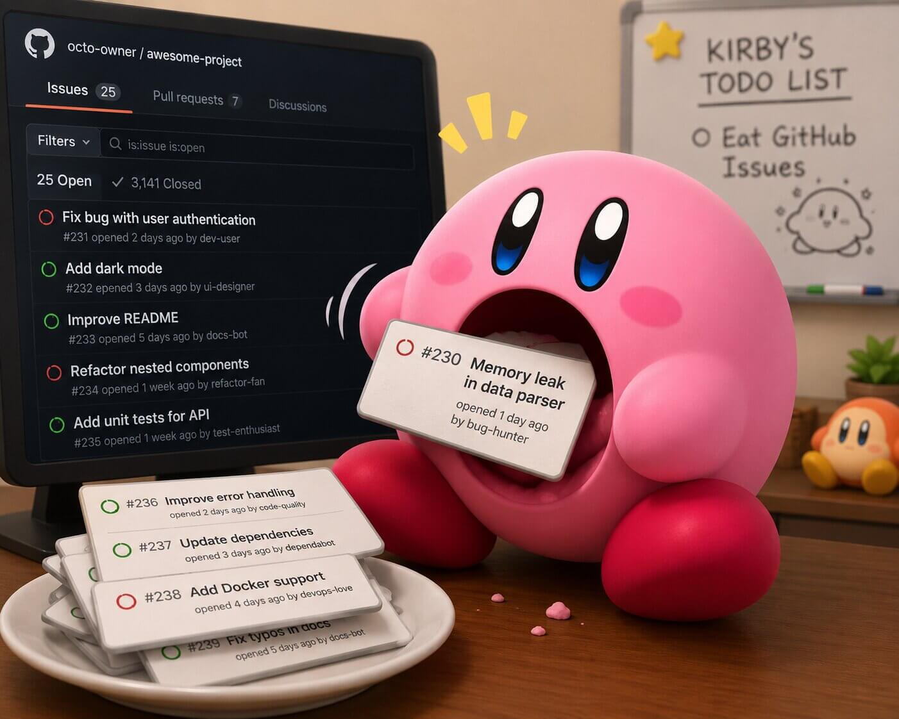
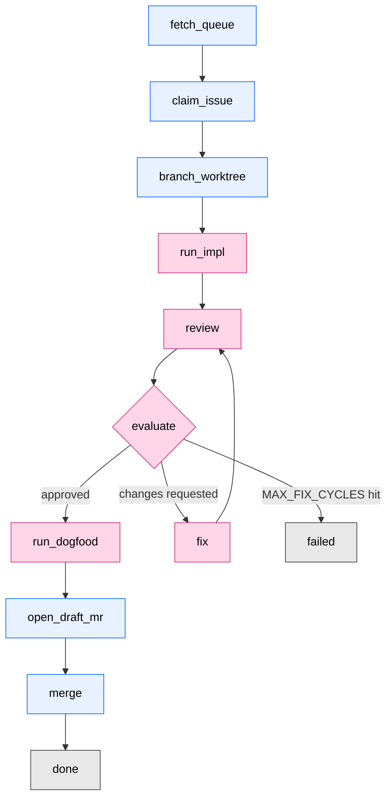

<div align="center">
  

  # kirby-bot

  *A deterministic state machine that drives Claude Code through your issue queue — one issue at a time, until the queue is empty.*

  [Features](#features) • [How it works](#how-it-works) • [Prerequisites](#prerequisites) • [Quick start](#quick-start) • [Configuration](#configuration) • [Architecture](#architecture)
</div>

---

kirby-bot picks an issue off your GitLab board, spins up a fresh `claude` session in tmux for each phase of the work (implement, review, evaluate, fix, dogfood), parses the verdict from the session, then opens an MR and merges it. If the reviewer disagrees, it loops back to `fix` until either the reviewer is satisfied or the cap is hit.

The bot is named after Kirby because, like Kirby, it eats issues whole and spits out merge requests.

## Features

- **Deterministic pipeline** — five named phases driven by an explicit state machine, not an open-ended agent loop.
- **Phase-per-session** — each interactive phase runs in an isolated `claude` tmux session with a phase-specific prompt; verdicts are parsed from the last assistant message via a Stop hook.
- **Self-healing fix loop** — `review` and `evaluate` decide whether to merge, fix, or fail. Up to `MAX_FIX_CYCLES` rounds before handing back to a human.
- **Hard budgets** — a 90-minute wall-clock cap per issue, per-phase caps, and a 2-minute ceiling on every shell-out. No hung command can freeze the run.
- **Run artifacts** — every run writes sentinel files, tmux logs, prompt files, and a structured `run.jsonl` to `~/.afk-runs/<run-id>/` for post-mortem.
- **Provider seam** — the orchestrator talks to GitLab today through a clean `Provider` interface; GitHub support is the obvious next adapter.
- **Stale-claim sweeper** — a companion script releases issues whose `picked-by-agent` claim has gone stale.

## How it works

For each issue the bot picks up, it transitions through the following phases:



- **Interactive phases** (`run_impl`, `review`, `evaluate`, `fix`, `run_dogfood`) spawn a fresh `claude` tmux session with a rendered prompt and wait for a verdict.
- **Script phases** (`open_draft_mr`, `merge`, plus setup/cleanup transitions) are pure shell work — no `claude` session.
- A **Stop hook** writes each session's last assistant message to a sentinel file; the orchestrator polls the sentinel and parses the verdict.

### Why tmux, not `claude -p`?

The orchestrator drives the **interactive** `claude` CLI inside a tmux session, not the headless `claude -p` flag or the Agent SDK. That distinction is billing-load-bearing.

> [!NOTE]
> Starting **June 15, 2026**, `claude -p` and the Claude Agent SDK no longer count toward your Claude plan's usage limits — they draw from a separate **monthly Agent SDK credit** ($20 on Pro, $100/$200 on Max). Interactive Claude Code usage stays on the regular plan limits. By driving the interactive CLI through tmux, kirby-bot reuses the limits you already pay for instead of burning through the (much smaller) SDK credit. See [Use the Claude Agent SDK with your Claude plan](https://support.claude.com/en/articles/15036540-use-the-claude-agent-sdk-with-your-claude-plan) for the full breakdown.

The full vocabulary (Phase / Verdict / Session / Provider / RunArtifacts / Module / Interface / Depth / Seam) is documented in [`CONTEXT.md`](CONTEXT.md).

## Prerequisites

- [Bun](https://bun.sh) ≥ 1.3.0
- [`tmux`](https://github.com/tmux/tmux)
- [`claude`](https://docs.claude.com/en/docs/claude-code) on your `$PATH`
- A GitLab project with the orchestrator's labels configured (`ready-for-agent`, `picked-by-agent`, `failed-by-agent`, `code-review`, …)
- A long-lived GitLab personal access token (`api` scope)
- The Claude Code skills the phase prompts (and their transitive fan-out) invoke via the `Skill` tool. All live in my [rbaumier/skills](https://github.com/rbaumier/skills) repo. The [Quick start](#quick-start) step `bun run setup-skills` populates them under `.claude/skills/` (project-scoped, which Claude Code resolves before `~/.claude/skills/`) — by symlinking from your `~/.claude/skills/` when present, or copying from a shallow clone of `rbaumier/skills` otherwise.

  **Directly invoked by the phase prompts:**
  - [`code-review`](https://github.com/rbaumier/skills/blob/main/code-review/SKILL.md) — invoked by the `review` phase to fan reviewer subagents over the diff.
  - [`dogfood`](https://github.com/rbaumier/skills/blob/main/dogfood/SKILL.md) — loaded by the persona subagents the `run_dogfood` phase spawns.

  **Transitively invoked by `code-review`'s fan-out.** The `code-review` skill spawns ~15+ reviewer subagents per Full-tier run; each loads its own skill via the `Skill` tool. The full set:

  | Bucket | Skills loaded |
  |---|---|
  | Always-spawn (Full tier) | [`matt-improve-codebase-architecture`](https://github.com/rbaumier/skills/blob/main/matt-improve-codebase-architecture/SKILL.md), [`matt-review`](https://github.com/rbaumier/skills/blob/main/matt-review/SKILL.md), [`thermo-nuclear-code-quality-review`](https://github.com/rbaumier/skills/blob/main/thermo-nuclear-code-quality-review/SKILL.md), [`security-defensive`](https://github.com/rbaumier/skills/blob/main/security-defensive/SKILL.md), [`coding-standards`](https://github.com/rbaumier/skills/blob/main/coding-standards/SKILL.md) (+ [`:design`](https://github.com/rbaumier/skills/blob/main/coding-standards:design/SKILL.md), [`:errors`](https://github.com/rbaumier/skills/blob/main/coding-standards:errors/SKILL.md), [`:hygiene`](https://github.com/rbaumier/skills/blob/main/coding-standards:hygiene/SKILL.md), [`:style`](https://github.com/rbaumier/skills/blob/main/coding-standards:style/SKILL.md)), [`testing`](https://github.com/rbaumier/skills/blob/main/testing/SKILL.md), [`matt-tdd`](https://github.com/rbaumier/skills/blob/main/matt-tdd/SKILL.md) |
  | By language extension | [`language-typescript`](https://github.com/rbaumier/skills/blob/main/language-typescript/SKILL.md), [`language-rust`](https://github.com/rbaumier/skills/blob/main/language-rust/SKILL.md), [`language-swift`](https://github.com/rbaumier/skills/blob/main/language-swift/SKILL.md), [`vue`](https://github.com/rbaumier/skills/blob/main/vue/SKILL.md) |
  | By import detected | [`better-result-adopt`](https://github.com/rbaumier/skills/blob/main/better-result-adopt/SKILL.md), [`database`](https://github.com/rbaumier/skills/blob/main/database/SKILL.md), [`docker`](https://github.com/rbaumier/skills/blob/main/docker/SKILL.md), [`drizzle-orm`](https://github.com/rbaumier/skills/blob/main/drizzle-orm/SKILL.md), [`i18n`](https://github.com/rbaumier/skills/blob/main/i18n/SKILL.md), [`kubernetes`](https://github.com/rbaumier/skills/blob/main/kubernetes/SKILL.md), [`react`](https://github.com/rbaumier/skills/blob/main/react/SKILL.md), [`shadcn`](https://github.com/rbaumier/skills/blob/main/shadcn/SKILL.md), [`tailwind`](https://github.com/rbaumier/skills/blob/main/tailwind/SKILL.md), [`tanstack-query`](https://github.com/rbaumier/skills/blob/main/tanstack-query/SKILL.md), [`tanstack-start-best-practices`](https://github.com/rbaumier/skills/blob/main/tanstack-start-best-practices/SKILL.md), [`ui-animations`](https://github.com/rbaumier/skills/blob/main/ui-animations/SKILL.md), [`vue`](https://github.com/rbaumier/skills/blob/main/vue/SKILL.md), [`zod`](https://github.com/rbaumier/skills/blob/main/zod/SKILL.md) |
  | By surface touched (path globs) | [`ui-ux`](https://github.com/rbaumier/skills/blob/main/ui-ux/SKILL.md), [`frontend`](https://github.com/rbaumier/skills/blob/main/frontend/SKILL.md), [`make-interfaces-feel-better`](https://github.com/rbaumier/skills/blob/main/make-interfaces-feel-better/SKILL.md), [`web-performance`](https://github.com/rbaumier/skills/blob/main/web-performance/SKILL.md), [`api-design`](https://github.com/rbaumier/skills/blob/main/api-design/SKILL.md) |

  Missing a transitively-spawned skill won't crash the phase — the spawning subagent fails its own `Skill` load and that slot is dropped from the review object — but the review will be silently shallower than intended.

> [!IMPORTANT]
> **OAuth2 tokens are not supported.** A single AFK run (several issues × 90-min budget) outlives the few-hour TTL of an OAuth2 token. The orchestrator reads `$GITLAB_TOKEN` first; if absent, it falls back to `~/.config/glab-cli/config.yml` but **skips** any host block flagged `is_oauth2: true`. If your only credential is the one `glab auth login` writes by default, the run fails at startup with a clear `ProviderConfigError`.
>
> Fix: create a long-lived PAT and export it before launching.
> ```bash
> glab api -X POST user/personal_access_tokens \
>   -f name=kirby-bot -f scopes[]=api
> export GITLAB_TOKEN=<the-returned-token>
> ```

## Quick start

```bash
# 1. Install
bun install

# 2. Populate .claude/skills/ — symlinks from ~/.claude/skills/ where present,
#    falls back to a shallow clone of rbaumier/skills for the rest. Idempotent.
bun run setup-skills

# 3. Check the prerequisites
which bun tmux claude
test -n "$GITLAB_TOKEN" && echo "token set"

# 4. Run
bun run src/main.ts
```

The orchestrator picks the first issue labelled `ready-for-agent` in the configured project and drives it through the pipeline. Hit `Ctrl-C` at any time — `BunRuntime.runMain` interrupts the fiber so every finalizer (worktree cleanup, label restoration, session kill) runs before exit.

Run artifacts land under `~/.afk-runs/<run-id>/`. Per-issue git worktrees live under `~/.afk-worktrees/<repo>/<branch>/`.

> [!TIP]
> Watch a phase live with `tmux attach -t <session-name>` — the session name is logged to `run.jsonl` when the phase starts.

## Configuration

Every tunable constant lives in [`src/config.ts`](src/config.ts) — no scattered env vars, no hidden defaults. The dials worth knowing:

| Constant | Default | What it caps |
|---|---|---|
| `ISSUE_BUDGET_MS` | 90 min | Total wall-clock per issue, from `run_impl` through `run_dogfood`. |
| `PHASE_CAP_MINUTES` | 25–45 min | Per-phase wall-clock cap. Secondary guard — the issue budget normally trips first. |
| `MAX_FIX_CYCLES` | 10 | Max review→fix loops before the issue is failed for a human. |
| `COMMAND_TIMEOUT_MS` | 2 min | Hard ceiling on any single shell-out (git, glab, jq, tmux). |
| `SENTINEL_POLL_MS` | 5 s | How often the orchestrator polls a phase's sentinel file. |
| `LABELS` | `ready-for-agent`, `picked-by-agent`, `failed-by-agent` | The GitLab labels the orchestrator reads and writes. |

Phase prompts live in [`assets/prompts/`](assets/prompts) — one file per interactive phase. They are rendered with `{scripts_dir}` substitution so helper scripts (`mr-discussion.ts`, …) resolve correctly inside the worktree.

## Project structure

```
src/
├── main.ts              # entry point — preflight, then runMachine
├── preflight.ts         # env + glab + tmux + claude checks
├── config.ts            # every tunable in one place
├── pipeline/            # state machine + handlers + the `step` seam
├── phases/              # the five interactive Phase Modules
├── session/             # tmux + Stop hook + sentinel + verdict parsing
├── provider/            # forge adapter seam (GitLab today)
├── recovery/            # stale-claim sweeping
└── run-artifacts.ts     # per-run logs (run.jsonl, prompts, tmux output)

assets/
├── prompts/             # one prompt template per interactive phase
└── readme/              # README assets

scripts/
├── setup-skills.ts         # populate .claude/skills/ via symlink + fallback clone
├── sweep-stale-claims.ts   # release issues whose claim has gone stale
└── mr-discussion.ts        # post/read MR discussion threads from prompts
```

## Architecture

For the design rationale and the deeper docs:

- [`CONTEXT.md`](CONTEXT.md) — living glossary. Canonical names for Phase / Verdict / Session / Provider / RunArtifacts / Module / Interface / Depth / Seam.
- [`docs/provider-vocabulary.md`](docs/provider-vocabulary.md) — provider seam vocabulary (Issue, PullRequestRef, Discussion) and the GitLab/GitHub adapter asymmetries.
- [`docs/2026-05-22-orchestrator-decomposition.md`](docs/2026-05-22-orchestrator-decomposition.md) — the decomposition into Phase / Session / Pipeline Modules.

## Scripts

```bash
bun test src/        # run the bun:test suite
bun run typecheck    # tsc --noEmit
bunx comply          # the project linter
```
